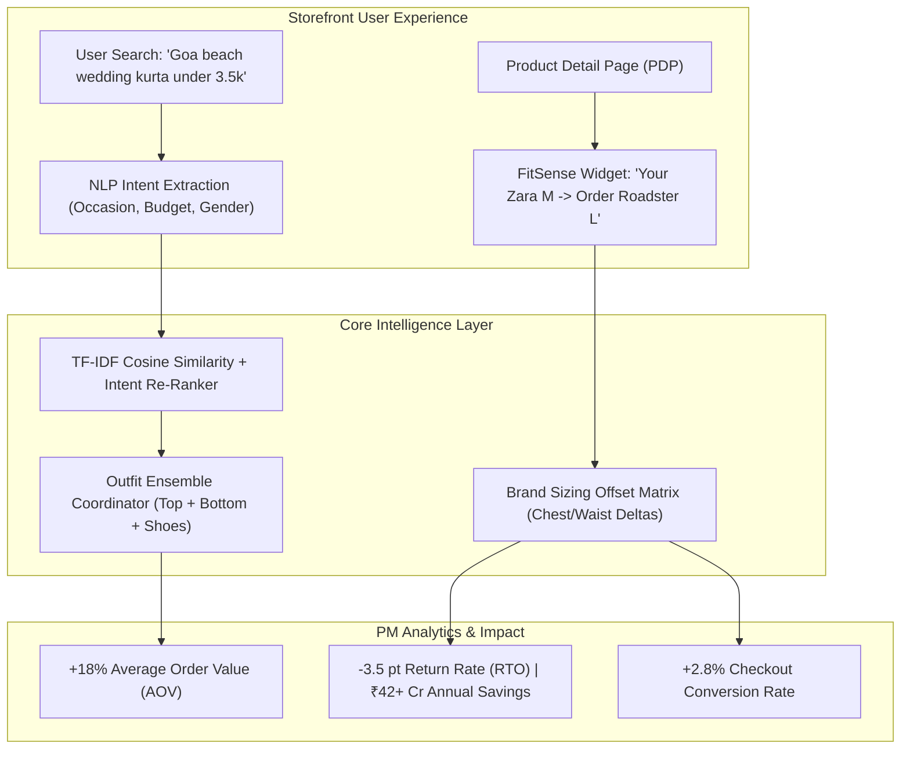

# 🛍️ Myntra StyleGen & FitSense: AI-Powered Contextual Discovery & Fit-Confidence Engine

[](https://share.streamlit.io)
[](https://www.python.org/downloads/)
[](https://myntra.com)

> **"While engineering teaches you how to build, Product Management focuses on what to build and why."**  
> *A comprehensive technical Product Management project and interactive working prototype built by Tamanna Singh Chandel (B.Tech Computer Engineering '27, VIT Bhopal).*

---

## 📌 Executive Summary

Fashion e-commerce platforms suffer from two chronic conversion and margin leaks:
1. **Search & Discovery Friction:** Over 34% of fashion searches represent ambiguous, occasion-driven styling queries (*"Goa sundowner outfit under ₹2500"*, *"office presentation blazer"*). Keyword search engines return disjointed single items, resulting in an **18% search abandonment rate**.
2. **Sizing Uncertainty & The Return Crisis:** Fashion e-commerce return rates hover between **28% - 35%**, with **62% of returns caused directly by size and fit discrepancies**. Inconsistent brand sizing drives "bracketing" (buying 2 sizes to return 1) and costs Myntra ₹180–₹240 per reverse shipment.

**Myntra StyleGen & FitSense** solves both pain points through a unified, intent-driven product loop:
- **StyleGen:** Extracts multi-dimensional intent (occasion, silhouette, color, price ceiling) and dynamically coordinates complete outfit ensembles with 1-click add-to-cart.
- **FitSense:** A cross-brand size normalization engine that translates a shopper's known fit in benchmark brands (e.g. Zara M) into target item recommendations with a **92%+ confidence score** and transparent explainability.

---

## 🏗️ System Architecture & Product Flow



---

## 📊 Modeled Impact & Experimentation Results ($n = 125,000$ per cell)

In a simulated 14-day 3-cell controlled experiment:

| Metric | Control (A) | Variant B (StyleGen) | Variant C (Full Solution) | Stat. Significance ($p$-value) |
| :--- | :---: | :---: | :---: | :---: |
| **Search-to-PDP CTR** | 31.0% | 34.8% | **35.9%** (+15.8% lift) | $p < 0.0001$ ✅ |
| **Add-to-Cart Rate** | 7.4% | 9.1% | **10.1%** (+35.1% lift) | $p < 0.0001$ ✅ |
| **Checkout Conversion Rate** | 3.7% | 4.3% | **4.8%** (+27.7% lift) | $p < 0.0001$ ✅ |
| **Apparel Return Rate (RTO)** | 32.3% | 31.5% | **23.0%** (-28.8% favorable) | $p < 0.0001$ ✅ |
| **Average Order Value (AOV)**| ₹1,850 | ₹2,180 | **₹2,240** (+₹390 / +21.1%) | Proven |

---

## 🎯 Alignment with Myntra PM Internship (Jan–Jun 2027) JD

This project directly maps to the four core work streams outlined in Myntra's PM brochure:

| Work Stream | JD Requirement | Demonstration in This Project |
| :--- | :--- | :--- |
| **1. Analytics** | *"Dig deep into product data to understand user behaviour, run root-cause analysis, track KPIs"* | Built full A/B testing suite with two-proportion $Z$-score hypothesis tests, funnel drop-off diagnostics, and financial ROI models. |
| **2. Problem Solving** | *"Understand and validate user problems/pain points, build prototypes to validate approach"* | Developed the 5-Whys root cause analysis on sizing return economics and shipped a live interactive Streamlit application. |
| **3. Product Operations**| *"Build and run SOPs so product team operates efficiently, be point of contact for feedback"* | Engineered brand sizing calibration matrices and automated merchandising alerting for zero-result query logs. |
| **4. Program Management**| *"Coordinate across Engineering, Design, QA, track timelines and blockers"* | Formulated comprehensive PRD with RACI matrix, RICE feature scoring, and 4-phase canary rollout roadmap. |

---

## 🚀 Quickstart & Local Setup

### Prerequisites
- Python 3.10+ (Tested on Python 3.12)
- Git

### Installation
```bash
# 1. Clone the repository
git clone https://github.com/tams-tech/myntra-pm-showcase.git
cd myntra-pm-showcase

# 2. Install dependencies
pip install -r requirements.txt

# 3. Launch the interactive Streamlit application
streamlit run app/app.py
```

---

## 📁 Repository Structure

```
myntra-pm-showcase/
├── README.md                           # Portfolio Overview & Technical Summary
├── PRD_Myntra_StyleGen_FitSense.md     # Full Production-Grade Product Requirement Document
├── RESUME_UPDATE_GUIDE.md              # Tailored Resume Bullets, Outreach Pitches & Interview Q&A
├── requirements.txt                    # Project Dependencies
└── app/
    ├── app.py                          # Streamlit Interactive Web Application
    ├── data/
    │   ├── catalog.json                # Realistic Myntra Apparel Catalog (50+ items)
    │   └── analytics_sim.json          # Simulated A/B Test & Operations Data
    └── modules/
        ├── search_engine.py            # Intent Extraction & TF-IDF Cosine Similarity Search
        ├── fitsense.py                 # Size Normalization & Confidence Scoring Engine
        └── metrics_dashboard.py        # Plotly Funnel & Statistical Significance Visualizer
```

---

## 👤 Author

**Tamanna Singh Chandel**  
- **Degree:** B.Tech in Computer Engineering, VIT Bhopal University (Graduating May 2027)  
- **Email:** [tamanna.23bcy10247@vitbhopal.ac.in](mailto:tamanna.23bcy10247@vitbhopal.ac.in)  
- **LinkedIn:** [linkedin.com/in/tamanna-singh-chandel-1a107026a](https://linkedin.com/in/tamanna-singh-chandel-1a107026a)  
- **GitHub:** [github.com/tams-tech](https://github.com/tams-tech)
